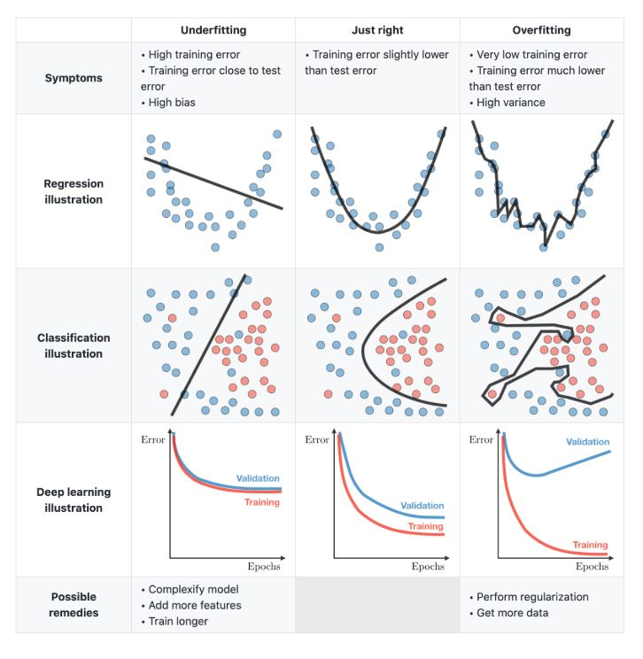

# StockPrediction
## Intro
A basic prediction make by supervised learning (ML).
Functionality: Predict stock price mathematically, without considering other factors such as environment, economics, or politics.

Current model: Linear Regression

FILE PROCESSING ORDER:
data_scraping.py -> process.py -> main.py (linear reg)

*How Supervised Learning work?
Supervised Learning has inputs of labeled data, meaning that we have to put in all combinations of (x, y). Then the model will draw the graph based on these points. Purpose of training supervised learning model: In the future, if you just input x, it will predict the matching y.

*About Linear Regression:
The most basic algorithm, the "Hello World" of Machine Learning. This works around the equation y = ax + b, with (x, y) is input data, (a, b) is calculated coeficients (by machine). 

Purpose: predict future data based on past data, work well on low variance data. Linear Regression maybe inefficient in Stock Predicting, so this is a challenging work.

*About data processing:
Stock market contains mainly real-time data, so huge effort has to be assigned to this work. 

Suggesting processing method to adapt with Linear Regression: Take stock price at the end of each day, divide in to many equal sections so that the data in each section form a line. 

2 axis of this Linear Regression problem can be y: price, x: time.

*About input data: 
There are 2 variables: 
X: array, containing time covert to number. ex: Jul 10 = 1, Jul 11 = 2, Jul 12 = 3,...
Y: array, containing stock price in the end of each day 

*Another approach (optional):
Using polynomial regression or logistic regression

*Note: 
overfitting: the model goes through all the points, which proved to be inefficient for generalization and practical applications.
underfitting: contrast with overfitting, the model mislocates almost all the points.

